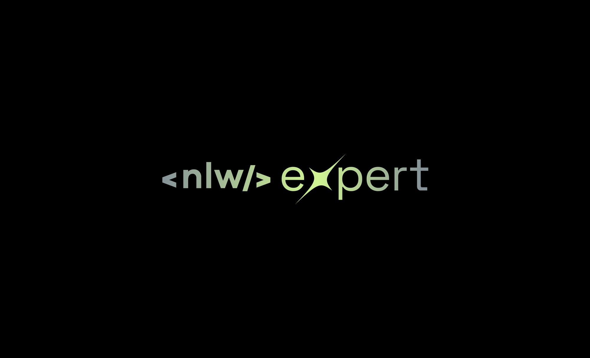

# Sistema de votação com resultados em tempo real

Este é um projeto de sistema de votação em tempo real, desenvolvido durante o evento NLW Expert na trilha de NodeJS da Rocketseat. O projeto utiliza tecnologias como Fastify, Prisma, Redis e WebSocket para permitir que os usuários votem em enquetes e vejam os resultados em tempo real.

## Funcionalidades

- Os usuários podem votar em opções de enquetes.
- Os resultados da votação são atualizados em tempo real para os usuários conectados.

## Como Rodar o Projeto

Siga as instruções abaixo para rodar o projeto em sua máquina local:

1. **Pré-requisitos**:
   - Node.js instalado em sua máquina
   - Docker instalado (para executar PostgressSQL e o Redis em um container)
2. **Clonar o Repositório**:
   <pre>

<code class="!whitespace-pre hljs language-bash">git clone https://github.com/paulomarquesdev/expert-votes.git
   </code>
3. **Instalar as Dependências**:
   <pre>

<code class="!whitespace-pre hljs language-bash">cd expert-nodes
   npm install
   </code>

</pre>
4. **Executar o Container Docker**:
   <pre>

<code class="!whitespace-pre hljs language-bash">docker compose up -d
   </code>

</pre>
5. **Executar as Migrações do Banco de Dados**:
   <pre>

<code class="!whitespace-pre hljs language-bash">npx prisma migrate dev
   </code>

</pre>
6. **Iniciar o Servidor**:
   <pre>

<code class="!whitespace-pre hljs language-bash">npm run dev
   </code>

</pre>

## Contribuição

Contribuições são bem-vindas! Sinta-se à vontade para abrir um problema ou enviar um pull request com melhorias, correções de bugs, ou novas funcionalidades.

## Contato

Para qualquer dúvida, crítica ou sugestão, você pode me contatar através das minhas redes sociais listadas em meu perfil aqui no GitHub.
